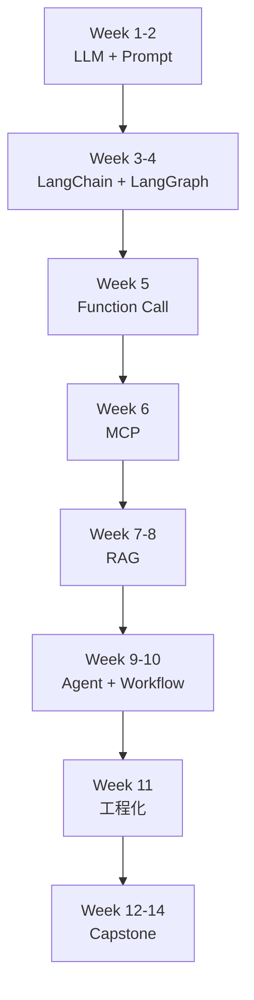

# Agent 从零学习计划（2026 版）

> **适用：** 完全重新开始，不假设任何前置知识  
> **周期：** 14 周（每周 10–15 小时）  
> **目标：** 能独立搭建「前端 + 后端」的 Agent 应用，并完成一个可演示的实战项目  
> **练习仓库：** 本 monorepo `agent-mono`（边学边写代码）  
> **历史归档：** 早期版本已清理，以本文件为唯一学习计划

---

## 当前仓库结构

```
agent-mono/
├── .env.example              # 统一环境变量模板
├── apps/
│   ├── web/                  # @agent-mono/web — Vue 3 前端
│   └── server/               # @agent-mono/server — Fastify 后端
├── packages/
│   └── shared/               # @agent-mono/shared — 共享类型
├── examples/
│   └── my-learning/          # Week 1–2 CLI 练习
├── docs/learning-notes/      # 每周复盘
└── tooling/                  # ESLint / TS 配置
```

### 开发命令

```bash
pnpm install
pnpm dev              # 同时启动 web (5173) + server (3001)
pnpm dev:web          # 仅前端
pnpm dev:server       # 仅后端
pnpm week1            # CLI 对话练习
```

### 代码怎么放

| 内容 | 放哪里 |
|------|--------|
| 页面、组件、前端交互 | `apps/web/src/` |
| API、Agent、LLM 调用 | `apps/server/src/routes/` |
| 前后端共用类型 | `packages/shared/src/` |
| 独立 CLI 实验 | `examples/<topic>/` |

学到 Week 3 以后，LangChain / MCP 等练习可在 `apps/server` 加路由，并在 `apps/web` 加对应页面联调；也可在 `examples/` 做纯后端实验。

---

## 怎么学才不容易忘

```
第 1 步：看概念（30%）→ 官方文档 / 本计划「核心概念」
第 2 步：跑 Demo（30%）→ 仓库里先跑通，看到输入输出
第 3 步：自己写（30%）→ 关掉参考，从零实现最小版本
第 4 步：复盘（10%）→ 每周日写 docs/learning-notes/week-N.md
```

**不要** 连续看三小时视频不动手。  
**要** 每学一个知识点，当天在仓库里留下一行可运行的代码。

---

## 总览

| 阶段 | 周次 | 主题 | 你要交付什么 |
|------|------|------|-------------|
| **一、基础** | 1–2 | LLM 原理 + API + Prompt | 能调 API 的对话脚本 + 3 种 Prompt 实验 |
| **二、框架** | 3–5 | LangChain / LangGraph + 工具调用 + MCP | 带记忆的链 + 天气 Agent + MCP Server |
| **三、核心** | 6–9 | RAG + Agent + Workflow | 知识库问答 + ReAct Agent + HITL 工作流 |
| **四、进阶** | 10–11 | 记忆 + 工程化 | 长期记忆 + 流式/缓存/成本监控 |
| **五、实战** | 12–14 | Capstone 项目 | 智能客服或自选题完整 Demo |



---

## 环境准备（第 0 天，约 2 小时）

在开始 Week 1 之前完成：

- [x] 克隆并安装依赖：`pnpm install`（仓库根目录）
- [x] 注册至少一个 LLM API（OpenAI / DeepSeek / 通义千问 任选）→ 填入根目录 `.env`
- [x] 复制 `.env.example` → `.env`（根目录一份即可，示例会向上读取）
- [x] 验证 Node.js ≥ 18，能运行 `pnpm exec tsx --version`
- [x] 创建笔记目录：`docs/learning-notes/`

**快速验证：**

```bash
pnpm install
pnpm exec tsx --version    # 应输出版本号
pnpm dev                   # 启动 web + server
pnpm week1                 # CLI 对话练习
```

---

## 阶段一：基础（第 1–2 周）

### Week 1：认识大模型与 API 调用

**本周目标：** 理解 LLM 是什么、怎么计费、怎么用代码发请求。

#### 核心概念

| 概念 | 一句话理解 |
|------|-----------|
| **Token** | 模型读写的最小单位；中文约 1–2 字 = 1 token；API 按 token 计费 |
| **Context Window** | 模型一次能「记住」的最大 token 数；超出后早期内容会被丢弃 |
| **Temperature** | 0 = 稳定确定（写代码）；0.7 = 日常对话；1.2+ = 创意但易胡说 |
| **Top-P** | 只在累积概率前 P 的候选词里选；越小越保守 |
| **Messages** | 对话格式：`system`（人设）/ `user`（用户）/ `assistant`（模型） |

#### 本周重点 API / 语法

| 类型 | 重点 |
|------|------|
| **外部 API** | `POST {OPENAI_BASE_URL}/chat/completions` |
| **本仓库 API** | `POST /api/chat`、`/chat` 页面 |
| **命令** | `pnpm week1`、`pnpm week1:curl`、`pnpm week1:experiments` |
| **重点语法** | `fetch()`、`messages: [{ role, content }]`、`temperature`、`usage.prompt_tokens`、`usage.completion_tokens` |
| **代码位置** | `examples/my-learning/src/week1-chat.ts`、`examples/my-learning/src/lib/chat-api.ts`、`apps/server/src/routes/chat.ts` |

#### 学习资料

- 📖 [OpenAI API Reference](https://platform.openai.com/docs/api-reference)
- 🎥 [3Blue1Brown — But what is a GPT?](https://www.youtube.com/watch?v=wjZofJX0v4M)（可选，帮助建立直觉）
- 📖 [LLM Visualization](https://bbycroft.net/llm)（交互式，推荐）

#### 实践任务

- [x] 注册 API，用 curl 或 Postman 发第一条 chat 请求 → `pnpm week1:curl`
- [x] 新建 `examples/my-learning/src/week1-chat.ts`：CLI 多轮对话（已重构，共用 `lib/chat-api.ts`）
- [x] 跑通 Web 对话页：`pnpm dev` 后访问 `/chat`（Web → Server → LLM）
- [x] 实验：同一问题分别用 `temperature: 0` 和 `temperature: 1.2` → `pnpm week1:experiments`
- [x] 实验：统计 input / output token → 见 `docs/learning-notes/week-1.md`

#### 验收

- [x] 能解释 Token、Temperature 是什么
- [x] 脚本可在终端连续对话至少 5 轮（本地运行 `pnpm week1` 自测）

---

### Week 2：提示词工程（Prompt Engineering）

**本周目标：** 会写 System Prompt，让模型稳定输出你要的格式。

#### 核心概念

| 概念 | 说明 |
|------|------|
| **Zero-shot** | 不给示例，直接描述任务 |
| **Few-shot** | 在 Prompt 里给 1–3 个输入输出示例 |
| **CoT（思维链）** | 加「请一步步思考」，提升推理题准确率 |
| **结构化输出** | JSON Mode / Schema 约束，让模型返回可解析的数据 |
| **反模式** | 指令模糊、示例不一致、要求互相矛盾 |

#### 本周重点 API / 语法

| 类型 | 重点 |
|------|------|
| **外部 API** | Chat Completions 的 `system` / `user` / `assistant` 消息结构 |
| **命令** | `pnpm week2` |
| **重点语法** | System Prompt、Zero-shot、Few-shot、CoT、JSON-only Prompt、`JSON.parse()`、正则提取 JSON |
| **代码位置** | `examples/my-learning/src/week2-prompts.ts`、`examples/my-learning/src/prompts/*` |

#### 学习资料

- 📖 [OpenAI Prompt Engineering Guide](https://platform.openai.com/docs/guides/prompt-engineering)（必读）
- 📖 [Prompt Engineering Guide 中文版](https://www.promptingguide.ai/zh)
- 🎥 [吴恩达 — ChatGPT Prompt Engineering for Developers](https://www.deeplearning.ai/short-courses/chatgpt-prompt-engineering-for-developers/)（免费，约 1 小时）

#### 实践任务

- [x] 写一个「代码审查助手」System Prompt → `examples/my-learning/src/prompts/code-review.ts`
- [x] Few-shot：让模型输出固定 JSON → `prompts/few-shot-json.ts`，运行 `pnpm week2`
- [x] CoT：分步解数学题 → `prompts/cot-math.ts`
- [x] 对比 3 种策略 → 见 `docs/learning-notes/week2.md`

#### 验收

- [x] 模型能稳定返回合法 JSON（5/5 次成功）
- [x] 能说出 Zero-shot / Few-shot / CoT 各自适用场景（见 week2 复盘）

---

## 阶段二：框架（第 3–5 周）

### Week 3：LangChain.js 入门

**本周目标：** 理解 LangChain 的核心抽象，用 LCEL 搭一条链。

#### 核心概念

| 概念 | 说明 |
|------|------|
| **Model** | 封装 LLM 调用（ChatOpenAI 等） |
| **Prompt Template** | 可复用的 Prompt 模板，支持变量注入 |
| **Output Parser** | 把模型文本解析成结构化对象 |
| **LCEL** | `prompt | model | parser` 管道式组合 |
| **Memory** | 在链里自动注入历史对话 |

#### 本周重点 API / 语法

| 类型 | 重点 |
|------|------|
| **本仓库 API** | `POST /api/learning/lcel-city`、`POST /api/learning/memory-chat`、`POST /api/learning/memory-reset` |
| **Web 页面** | `/learning` |
| **LangChain API** | `ChatPromptTemplate`、`ChatOpenAI`、`StructuredOutputParser.fromZodSchema()`、`RunnableWithMessageHistory`、`InMemoryChatMessageHistory` |
| **重点语法** | `prompt.pipe(model).pipe(parser)`、`chain.invoke()`、`parser.getFormatInstructions()`、`new MessagesPlaceholder("history")`、`sessionId` |
| **代码位置** | `apps/server/src/lib/lcel/city-weather-chain.ts`、`apps/server/src/lib/memory/memory-chat.ts`、`apps/web/src/views/LearningView.vue` |

#### 学习资料

- 📖 [LangChain.js 官方文档](https://js.langchain.com/docs/)（必读）
- 📖 [LangChain.js 中文教程](https://js.langchain.com.cn/)

#### 实践任务

- [x] 在 `apps/server/src/routes/` 实现 LCEL 链，并在 `apps/web` 加联调页面 → `/learning`
- [x] 实现：`Prompt → LLM → OutputParser` 链，输入城市名，输出 `{ city, weather, tip }` JSON
- [x] 实现带 Memory 的多轮对话 → `RunnableWithMessageHistory`

#### 验收

- [x] 能画出 `Prompt → Model → Parser` 数据流 → 见 `docs/learning-notes/week-3.md`
- [x] Memory 对话能记住上一轮提到的信息（实测记住「小明」）

---

### Week 4：LangGraph 与工作流基础

**本周目标：** 理解状态图，实现多步骤可观测工作流。

#### 核心概念

| 概念 | 说明 |
|------|------|
| **StateGraph** | 节点 + 边组成的有向图，每个节点读写共享状态 |
| **Node** | 一个处理步骤（调 LLM、调工具、做校验） |
| **Edge** | 节点之间的流转；可以是固定边或条件边 |
| **State** | 图里流转的数据结构（如 `{ messages, steps, result }`） |

#### 本周重点 API / 语法

| 类型 | 重点 |
|------|------|
| **本仓库 API** | `POST /api/learning/langgraph-workflow`、`POST /api/learning/langgraph-router` |
| **Web 页面** | `/learning` 的 LangGraph 示例区 |
| **LangGraph API** | `Annotation.Root()`、`StateGraph`、`START`、`END` |
| **重点语法** | `addNode()`、`addEdge()`、`addConditionalEdges()`、`graph.compile()`、`app.invoke()`、`steps` reducer |
| **代码位置** | `apps/server/src/lib/langgraph/simple-workflow.ts`、`apps/web/src/components/learning/LangGraphWorkflowDemo.vue` |

#### 学习资料

- 📖 [LangGraph.js 官方文档](https://langchain-ai.github.io/langgraphjs/)
- 📖 [LangGraph 概念 — StateGraph](https://langchain-ai.github.io/langgraphjs/concepts/low_level/)

#### 实践任务

- [x] 在 `apps/server/src/routes/` 实现 LangGraph 工作流，Web 学习页展示 `steps`
  - 输入：`(12 + 8) * 3`
  - 路径：`classify → plan → solveMath → finalize`
  - 返回 `steps` 数组，每步含 `node` 与 `detail`
- [x] 自己写一个 3 节点图：接收问题 → 分类 → 回答（数学走计算，否则走闲聊）

#### 验收

- [x] 能解释 Node、Edge、State 三者关系 → 见 `docs/learning-notes/week-4.md`
- [x] 自定义 3 节点图可运行并打印每步状态

---

### Week 5：Function Calling（函数调用）

**本周目标：** 让 AI 自动决定调用哪个外部函数，并处理完整消息流。

#### 核心概念

| 概念 | 说明 |
|------|------|
| **Tool / Function** | 用 JSON Schema 描述函数名、参数、说明 |
| **tool_calls** | 模型返回「我要调用这些函数」的结构化请求 |
| **tool 角色消息** | 你把函数执行结果以 `role: tool` 发回给模型 |
| **并行调用** | 模型一次请求多个 tool，可 `Promise.all` 并发执行 |
| **安全** | 参数校验、白名单、超时、禁止任意代码执行 |

#### 本周重点 API / 语法

| 类型 | 重点 |
|------|------|
| **本仓库 API** | `POST /api/learning/weather-agent` |
| **外部 API** | OpenAI Tool / Function Calling：`tools`、`tool_calls`、`tool` role message |
| **重点语法** | JSON Schema 工具定义、`Promise.all()` 并行工具、指数退避重试、工具参数白名单校验 |
| **建议工具函数** | `get_weather(city)`、`get_current_time(city)`、`get_clothing_advice(tempDiff, weatherSummary)` |
| **建议代码位置** | `apps/server/src/routes/learning.ts`、`apps/server/src/lib/tools/`、`apps/web/src/components/learning/` |

#### 消息流（必须理解）

```
user: "北京上海今天天气对比"
  ↓
assistant: { tool_calls: [get_weather(北京), get_weather(上海), ...] }
  ↓
tool: { name: get_weather, content: "北京 晴 25°C" }
tool: { name: get_weather, content: "上海 雨 22°C" }
  ↓
assistant: "北京今天晴25度，上海有雨22度，建议..."
```

#### 学习资料

- 📖 [OpenAI Function Calling Guide](https://platform.openai.com/docs/guides/function-calling)（必读）
- 📖 [Vercel AI SDK — Tool Calling](https://sdk.vercel.ai/docs/ai-sdk-core/tools-and-tool-calling)

#### 实践任务

- [x] 在 `apps/server` 实现天气对比 Agent（Function Call），Web 展示工具调用轨迹
- [x] 3 个工具：`get_weather` / `get_current_time` / `get_clothing_advice`
- [x] 北京 + 上海并行查询
- [x] 单工具失败时重试 3 次（200ms / 500ms / 1000ms），不阻断整轮

#### 验收

- [x] 输入「对比北京和上海天气并给穿衣建议」能稳定完成
- [x] 能手绘 tool_calls 完整时序图 → 见 `docs/learning-notes/week-5.md`

---

## 阶段三：核心（第 6–9 周）

### Week 6：MCP 协议

**本周目标：** 理解 MCP 如何标准化「模型 ↔ 工具」连接。

#### 核心概念

| 概念 | 说明 |
|------|------|
| **Host** | 宿主应用（Cursor、Claude Desktop、你的 Web App） |
| **Client** | Host 内的 MCP 客户端，负责协议通信 |
| **Server** | 暴露 tools / resources / prompts 的独立进程 |
| **stdio / SSE / HTTP** | 三种传输方式；本地开发用 stdio 最简单 |
| **三大原语** | Resources（只读上下文）、Tools（可执行）、Prompts（模板） |

#### 本周重点 API / 语法

| 类型 | 重点 |
|------|------|
| **练习入口** | `examples/mcp-learning/` |
| **MCP API** | `McpServer`、`Client`、`StdioServerTransport`、`StdioClientTransport` |
| **重点语法** | `server.tool()`、`server.resource()`、`server.prompt()`、`client.listTools()`、`client.callTool()` |
| **重点概念** | Host / Client / Server、Resources / Tools / Prompts |

#### 学习资料

- 📖 [MCP 官方文档](https://modelcontextprotocol.io/)（必读）
- 🔧 [MCP Inspector](https://github.com/modelcontextprotocol/inspector)

#### 实践任务

- [ ] 在 `examples/mcp-learning/` 实现 MCP Server + Client（stdio）
- [ ] 给 Server 新增 `read_file` / `write_file` 工具（限制在工作目录）
- [ ] 接入 Cursor 或 Claude Desktop，在 IDE 里调用你的 MCP tool
- [ ] 写对比笔记：MCP vs 直接 Function Call 各适合什么场景

#### 验收

- [ ] Host 能 list 并 invoke 你的 MCP tools
- [ ] 能画出 Host → Client → Server 三层图

---

### Week 7–8：RAG（检索增强生成）

**本周目标：** 搭建「私有文档 → 向量检索 → 生成回答」完整链路。

#### 核心概念

| 概念 | 说明 |
|------|------|
| **Embedding** | 把文本变成向量，语义相近的文本向量距离近 |
| **Chunking** | 长文档切小块；块太大丢细节，太小丢上下文 |
| **Vector Store** | 存向量并做相似度搜索（Chroma、pgvector 等） |
| **Retrieval** | 用户问题 → 取向量 → 找最相似的 chunks |
| **RAG 流程** | 检索相关文档 → 塞进 Prompt → LLM 基于文档回答 |
| **优化** | Re-ranking、Hybrid Search、Query Expansion |

#### 本周重点 API / 语法

| 类型 | 重点 |
|------|------|
| **计划 API** | `POST /api/rag/ingest`、`POST /api/rag/query` |
| **LangChain API** | Document Loader、Text Splitter、Embedding Model、Vector Store、Retriever |
| **重点语法** | `splitDocuments()`、`embedQuery()`、`similaritySearch()`、`retriever.invoke()`、`topK`、chunk size / overlap |
| **建议代码位置** | `apps/server/src/lib/rag/`、`apps/server/src/routes/rag.ts`、`apps/web/src/views/RagView.vue` |

#### 学习资料

- 📖 [LangChain RAG 教程](https://js.langchain.com/docs/tutorials/rag/)
- 🎥 [吴恩达 — Building Advanced RAG](https://www.deeplearning.ai/short-courses/building-evaluating-advanced-rag/)

#### 实践任务

**Week 7**

- [ ] 在 `examples/rag-learning/` 新建并实现完整 RAG 链路
- [ ] 准备 3–5 篇 Markdown 文档作为知识库
- [ ] 实现：加载 → 分块 → Embedding → 存入向量库

**Week 8**

- [ ] 实现问答：用户提问 → 检索 top-k → 生成回答
- [ ] 对比 2 种 chunk 策略（如 500 字 vs 1000 字），记录检索质量差异
- [ ] 加入 Re-ranking 或 Hybrid Search 中的一项
- [ ] 准备 10 条 QA 测试集，人工评估命中率

#### 验收

- [ ] 知识库问答能引用文档内容，不胡编
- [ ] 10 条测试集命中率 ≥ 70%（可人工判）

---

### Week 9：Agent 智能体

**本周目标：** 理解 ReAct 循环，构建能自主选工具的多步 Agent。

#### 核心概念

| 概念 | 说明 |
|------|------|
| **Agent** | 能感知 → 思考 → 行动 → 再感知的自主循环 |
| **ReAct** | Reasoning + Acting：边想边做，根据工具结果调整下一步 |
| **Plan-and-Execute** | 先规划步骤，再逐步执行 |
| **Supervisor** | 一个调度 Agent 分配任务给多个专业 Agent |
| **Guardrails** | 输出校验、危险操作拦截 |

#### 本周重点 API / 语法

| 类型 | 重点 |
|------|------|
| **练习入口** | `examples/agent-practice/` 或 `apps/server/src/lib/agent/` |
| **LangGraph Agent API** | `createAgent` / prebuilt ReAct Agent、`tool()`、`MemorySaver` |
| **重点语法** | ReAct 循环、工具注册、`thread_id`、`checkpointer`、guardrails 输出校验 |
| **建议 API** | `POST /api/agent/react`、`POST /api/agent/supervisor` |

#### 学习资料

- 📖 [LangGraph Agent 教程](https://langchain-ai.github.io/langgraphjs/tutorials/)
- 📖 [Anthropic — Building Effective Agents](https://www.anthropic.com/engineering/building-effective-agents)

#### 实践任务

- [ ] 在 `examples/agent-practice/` 实现 ReAct + Supervisor 多 Agent

#### 验收

- [ ] ReAct Agent 能多步调用工具完成任务
- [ ] 能说出 Agent 和 Workflow 的区别与选型原则

---

### Week 10：Workflow 工作流

**本周目标：** 掌握确定性流程编排，含人工审批与错误恢复。

#### 核心概念

| 概念 | 说明 |
|------|------|
| **Workflow vs Agent** | 步骤固定用 Workflow；步骤不确定用 Agent |
| **DAG** | 有向无环图，步骤按依赖顺序执行 |
| **条件分支** | 根据状态走不同路径（如质量不达标则重写） |
| **HITL** | Human-in-the-Loop，关键节点等人审批 |
| **持久化** | 工作流状态存盘，支持中断后恢复 |

#### 本周重点 API / 语法

| 类型 | 重点 |
|------|------|
| **练习入口** | `examples/workflow-practice/` 或 `apps/server/src/lib/workflow/` |
| **LangGraph API** | `StateGraph`、`interrupt()`、`MemorySaver` |
| **重点语法** | DAG、条件边、循环边、Human-in-the-loop、`resume`、checkpoint 持久化 |
| **建议 API** | `POST /api/workflow/content`、`POST /api/workflow/resume` |

#### 学习资料

- 📖 [LangGraph 工作流文档](https://langchain-ai.github.io/langgraphjs/concepts/)

#### 实践任务

- [ ] 在 `examples/workflow-practice/` 实现内容创作 DAG + HITL + 持久化

#### 验收

- [ ] 完成内容创作全流程 Demo
- [ ] HITL 节点能在中断后 resume 继续

---

## 阶段四：进阶（第 11–12 周）

### Week 11：记忆系统

**本周目标：** 实现跨会话记忆与超长对话压缩。

#### 核心概念

| 类型 | 说明 |
|------|------|
| **短期记忆** | 当前对话的 messages 数组 |
| **长期记忆** | 向量库存用户偏好、历史摘要，跨 session 检索 |
| **摘要压缩** | 对话过长时自动 summarize，替换早期消息 |

#### 本周重点 API / 语法

| 类型 | 重点 |
|------|------|
| **计划 API** | `POST /api/memory/extract`、`POST /api/memory/search`、`POST /api/chat/with-memory` |
| **框架 API** | `MemorySaver`、Vector Store Retriever、Embedding Model |
| **重点语法** | 用户偏好抽取、按 `userId/sessionId` 检索记忆、摘要压缩、context 裁剪 |
| **建议代码位置** | `apps/server/src/lib/memory/`、`apps/server/src/routes/memory.ts` |

#### 学习资料

- 📖 [LangGraph Memory 文档](https://langchain-ai.github.io/langgraphjs/concepts/memory/)
- 在 `examples/agent-practice/` 中实现记忆模块

#### 实践任务

- [ ] 跑通并理解 `04-memory-agent.ts`
- [ ] 实现：用户说「我喜欢简短回答」→ 下次对话仍遵守
- [ ] 实现：超过 20 轮自动摘要，context 不爆窗

#### 验收

- [ ] 第二次 session 能引用第一次的用户偏好

---

### Week 12：工程化（流式、缓存、成本）

**本周目标：** 让 Demo 具备生产级基本能力。

#### 核心概念

| 主题 | 说明 |
|------|------|
| **SSE 流式** | 逐 token 推送到前端，降低首字延迟 |
| **语义缓存** | 相似问题直接返回缓存，省 token |
| **模型路由** | 简单任务小模型，复杂任务大模型 |
| **成本监控** | 记录每次调用的 token 与估算费用 |
| **Eval** | 固定测试集 + 自动化评估 pass rate |

#### 本周重点 API / 语法

| 类型 | 重点 |
|------|------|
| **计划 API** | `GET /api/chat/stream`、`GET /api/metrics/cost`、`POST /api/eval/run` |
| **Web API** | `EventSource`、`ReadableStream`、`AbortController` |
| **Server 语法** | `text/event-stream`、`data:` SSE 事件、流式 token 输出 |
| **工程语法** | cache key、token 计费记录、eval case runner、pass rate 统计 |
| **建议代码位置** | `apps/server/src/routes/stream.ts`、`apps/web/src/composables/useSseChat.ts` |

#### 实践任务

- [ ] 在练习项目中为 chat 接口加 SSE 流式输出
- [ ] 实现精确缓存或语义缓存（二选一）
- [ ] 每次 LLM 调用记录 token 用量
- [ ] 准备 20 条 Agent eval case，脚本化跑分

#### 验收

- [ ] 前端能流式显示回复
- [ ] 有 eval 脚本和 pass rate 输出

---

## 阶段五：实战（第 13–14 周）

### Capstone：智能客服（Week 13–14）

**目标：** 在现有 `apps/server` + `apps/web` 上扩展 RAG 问答、意图路由、转人工与工具调用。

#### 本周重点 API / 语法

| 类型 | 重点 |
|------|------|
| **Capstone API** | `POST /api/customer-service/chat`、`POST /api/customer-service/handoff`、`POST /api/rag/query`、`GET /api/chat/stream` |
| **综合框架 API** | RAG Retriever、Tool Calling、LangGraph Workflow、Memory / Checkpoint |
| **重点语法** | 模块化路由、共享类型、SSE 事件、工具轨迹、端到端 eval、错误降级 |
| **交付物代码位置** | `apps/server/src/routes/`、`apps/server/src/lib/`、`apps/web/src/views/`、`packages/shared/src/` |

#### Week 13–14 交付物

- [ ] 可运行 Demo（`pnpm dev` 一键启动）
- [ ] 架构说明 + 20 条 eval 报告
- [ ] `docs/learning-notes/capstone.md` 复盘

#### 备选 Capstone

| 项目 | 难度 | 适合 |
|------|------|------|
| AI 代码审查助手 | ⭐⭐⭐ | 想深耕 Agent + MCP |
| 企业知识库 Copilot | ⭐⭐⭐ | 想深耕 RAG |
| 多 Agent 内容创作平台 | ⭐⭐⭐⭐⭐ | 想挑战 Supervisor + Workflow |

---

## 仓库练习地图

| 周次 | 路径 | 做什么 |
|------|------|--------|
| 1–2 | `examples/my-learning/` + `apps/web` + `apps/server` | CLI 脚本 + Web 对话页 |
| 3 | `apps/server/src/routes/` + `apps/web/src/views/` | LCEL、Memory |
| 4 | `apps/server` LangGraph 路由 + Web 步骤展示 | 多步骤工作流 |
| 5 | `apps/server` Function Call + Web 工具轨迹 | 天气 Agent |
| 6 | `examples/mcp-learning/` | MCP Server / Client |
| 7–8 | `apps/server` RAG 模块 + Web 问答页 | RAG 全流程 |
| 9 | `examples/agent-practice/` 或迁入 server | ReAct、Supervisor |
| 10 | `examples/workflow-practice/` | DAG、HITL |
| 11 | server Agent 记忆模块 | 长期记忆 |
| 12 | `apps/web` SSE + server 缓存/Eval | 工程化 |
| 13–14 | 扩展 `apps/server` + `apps/web` | Capstone 智能客服 |

---

## 每周节奏

| 时间 | 活动 | 时长 |
|------|------|------|
| 周一 | 读文档 + 核心概念 | 1.5h |
| 周二 | 跑仓库 Demo | 1.5h |
| 周三 | 读源码，理解实现 | 1.5h |
| 周四 | 自己写最小版本 | 2h |
| 周五 | 继续写 + 调试 | 2h |
| 周六 | 联调 / 扩展功能 | 3h |
| 周日 | 写周复盘 + 勾选进度 | 1h |

**周复盘模板**（`docs/learning-notes/week-N.md`）：

```markdown
# Week N 复盘

## 本周学了什么（3 条以内）
## 跑通 / 实现了什么
## 卡住的问题与解法
## 下周计划
```

---

## 进度追踪

### 阶段一：基础
- [ ] Week 1：API 调用 + Token / Temperature 实验
- [ ] Week 2：Prompt 工程（System / Few-shot / CoT / JSON）

### 阶段二：框架
- [x] Week 3：LangChain LCEL + Memory
- [x] Week 4：LangGraph 多步骤工作流
- [x] Week 5：Function Calling 端到端

### 阶段三：核心
- [ ] Week 6：MCP Server + Host 接入
- [ ] Week 7–8：RAG 知识库问答
- [ ] Week 9：ReAct + Supervisor Agent
- [ ] Week 10：Workflow + HITL

### 阶段四：进阶
- [ ] Week 11：长期记忆 + 对话压缩
- [ ] Week 12：流式 + 缓存 + Eval

### 阶段五：实战
- [ ] Week 13：Capstone 集成
- [ ] Week 14：测试 + 架构文档 + 复盘

---

## 技术选型速查

遇到需求时，按此决策：

```
需要固定格式输出？        → Prompt + JSON Schema
需要查私有文档？          → RAG
需要调外部 API？          → Function Call / MCP
步骤不确定、需自主决策？   → Agent（ReAct）
步骤固定、可预测？        → Workflow（LangGraph）
需要跨会话记住用户？       → 长期记忆（向量库）
要特定语气/格式且 RAG 不够？ → Fine-tuning（见选修）
```

**选修：模型微调** — 完成主线后如有兴趣，在 `examples/finetuning-practice/` 自行新建练习

---

## 推荐资源

### 必读

| 资源 | 用途 |
|------|------|
| [OpenAI 文档](https://platform.openai.com/docs/) | API 权威参考 |
| [LangChain.js 文档](https://js.langchain.com/docs/) | JS/TS Agent 框架 |
| [LangGraph.js 文档](https://langchain-ai.github.io/langgraphjs/) | 图编排 |
| [MCP 文档](https://modelcontextprotocol.io/) | 工具协议 |
| [DeepLearning.AI 短课](https://www.deeplearning.ai/short-courses/) | 吴恩达免费课 |

### 工具

| 工具 | 用途 |
|------|------|
| [LangSmith](https://smith.langchain.com/) | 调用追踪调试 |
| [MCP Inspector](https://github.com/modelcontextprotocol/inspector) | MCP 调试 |
| [Ollama](https://ollama.com/) | 本地跑开源模型（可选） |

---

## 14 周后的你

- 能独立调用 LLM API，设计 Prompt 和结构化输出
- 能用 LangChain / LangGraph 构建链、Agent、工作流
- 能开发 Function Call 和 MCP Server，并接入 IDE
- 能搭建 RAG 知识库问答并做基本评估
- 能实现流式前端、工具轨迹、成本记录
- 有一个 **可演示、可讲解** 的 Capstone 项目

---

> **现在就开始：** 完成「环境准备」清单，然后从 **Week 1** 写第一个 `week1-chat.ts` 脚本。每完成一周，在本文档对应章节打勾。
