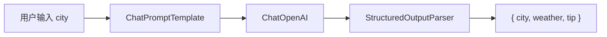

# Week 3 复盘 — LangChain.js LCEL & Memory

## 数据流（LCEL 城市天气）



**管道代码：** `prompt.pipe(model).pipe(parser)`  
**位置：** `apps/server/src/lib/lcel/city-weather-chain.ts`  
**API：** `POST /api/learning/lcel-city`  
**Web：** `/learning` 页面「运行 LCEL」

### 实测（北京）

```json
{
  "city": "北京",
  "weather": "晴，10°C，微风",
  "tip": "早晚温差较大，建议携带外套，白天适宜户外活动。"
}
```

---

## Memory 多轮对话

**实现：** `RunnableWithMessageHistory` + `InMemoryChatMessageHistory`（按 `sessionId` 隔离）  
**位置：** `apps/server/src/lib/memory/memory-chat.ts`  
**API：** `POST /api/learning/memory-chat` · `POST /api/learning/memory-reset`

### 实测

| 轮次 | 用户 | AI |
|------|------|-----|
| 1 | 我叫小明，回答请尽量简短。 | 好的，小明。记住了。 |
| 2 | 我叫什么名字？ | 你叫小明。 |

Memory 能记住上一轮提到的名字 ✅

---

## 启动方式

```bash
pnpm dev
# 浏览器打开 http://localhost:5173/learning
```

## 下周

Week 4：LangGraph 多步骤工作流
