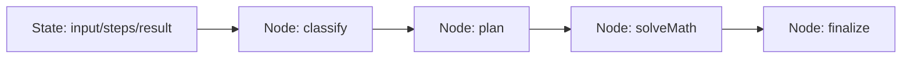

# Week 4 复盘 — LangGraph 工作流

## Node / Edge / State 是什么



- **State**：整张图共享的数据，例如 `input`、`classification`、`result`、`steps`
- **Node**：处理状态的函数，返回对状态的局部更新
- **Edge**：节点之间的执行顺序，包含普通边与条件边

## 4 节点工作流

位置：`apps/server/src/lib/langgraph/simple-workflow.ts`

路径：

```text
START → classify → plan → solveMath → finalize → END
```

输入：

```text
(12 + 8) * 3
```

输出：

```json
{
  "input": "(12 + 8) * 3",
  "classification": "math",
  "plan": "先保留输入表达式，再调用 solveMath 节点计算，最后整理答案。",
  "result": "(12 + 8) * 3 = 60",
  "steps": [
    { "node": "classify", "detail": "识别为数学表达式" },
    { "node": "plan", "detail": "先保留输入表达式，再调用 solveMath 节点计算，最后整理答案。" },
    { "node": "solveMath", "detail": "计算结果为 60" },
    { "node": "finalize", "detail": "最终输出：(12 + 8) * 3 = 60" }
  ]
}
```

## 3 节点分类图

路径：

```text
START → classify → answer → finalize → END
```

规则：

- 输入只包含数字、括号和 `+ - * /` → `math`
- 其他输入 → `chat`

实测：

| 输入 | 分类 | 输出 |
|------|------|------|
| `12 / 4 + 7` | `math` | `12 / 4 + 7 = 10` |
| `你好` | `chat` | `收到：你好` |

## Web 联调

页面：`/learning`

组件：`apps/web/src/components/learning/LangGraphWorkflowDemo.vue`

可以在页面上看到每个节点的 `steps`，这就是工作流路径的可观测结果。
