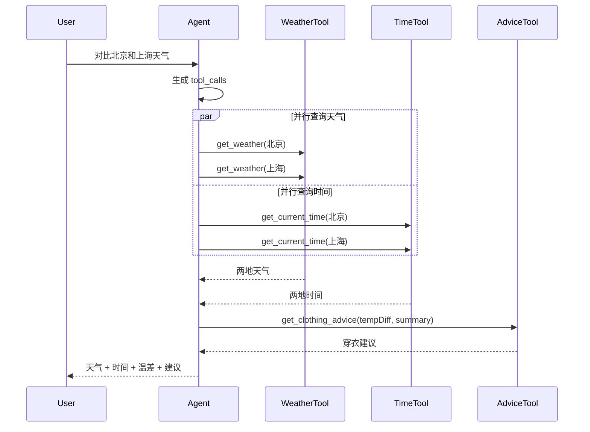

# Week 5 复盘 — Function Calling 天气 Agent

## 本周目标

实现「北京 vs 上海」天气对比 Agent：

- 模型根据用户问题决定工具调用
- Server 并行执行天气 / 时间工具
- 工具失败时按 `200ms / 500ms / 1000ms` 重试
- Web 展示完整工具调用轨迹

## API 与代码

| 类型 | 内容 |
|------|------|
| API | `POST /api/learning/weather-agent` |
| Server | `apps/server/src/lib/tools/weather-agent.ts` |
| Route | `apps/server/src/routes/learning.ts` |
| Web | `apps/web/src/components/learning/WeatherAgentDemo.vue` |
| Shared Types | `packages/shared/src/learning.ts` |

## 工具定义

| 工具 | 参数 | 作用 |
|------|------|------|
| `get_weather` | `city`, `date?` | 查询 mock 天气 |
| `get_current_time` | `city` | 查询城市当前时间 |
| `get_clothing_advice` | `tempDiff`, `weatherSummary` | 生成穿衣建议 |

## tool_calls 时序图



## 实测结果

### 正常输入

```text
帮我对比北京和上海今天的天气，并告诉我两地当前时间与温差建议
```

结果：

- 北京：晴，8°C
- 上海：小雨，14°C
- 温差：6°C
- 建议：按较冷城市准备外套，上海带伞

### 超时重试输入

```text
帮我对比北京和上海今天的天气，模拟超时，并告诉我建议
```

结果：

- 北京 `get_weather` 前 3 次模拟超时
- 第 4 次成功
- 其他工具不阻塞，继续并行完成
- 最终回答正常返回

## 关键语法

```ts
const firstBatch = await Promise.all(
  initialCalls.map((call) => executeTool(call, options)),
);
```

并行执行多个工具调用。

```ts
const retryDelays = [200, 500, 1000];
```

失败后指数退避重试。

```ts
flow.push({ type: "tool_start", ... });
flow.push({ type: "tool_end", ... });
flow.push({ type: "error", ... });
flow.push({ type: "token", content: answer });
```

把后端执行过程变成前端可观察事件。

## 注意

这里的天气是 mock 数据，不调用真实天气 API。重点是学习 Function Calling 的消息流、工具执行、并行调用和错误处理。
